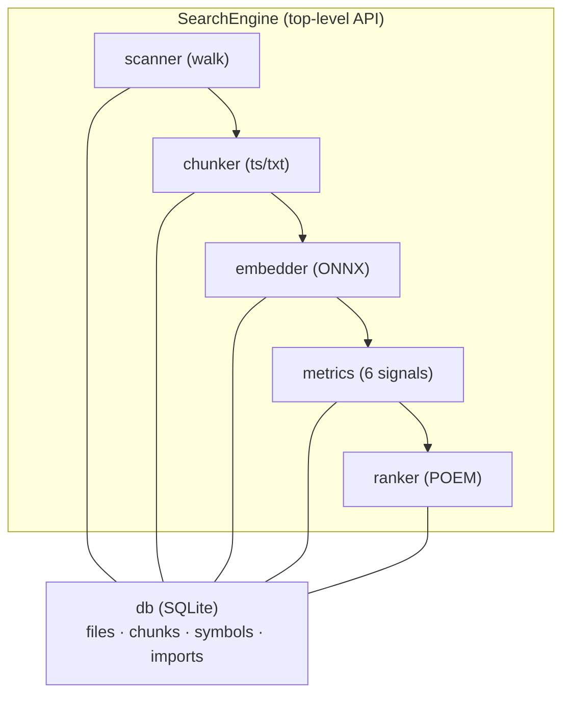

# search-semantically


Embeddable semantic code search with multi-signal POEM ranking.

A Rust library crate that provides local, incremental code search combining BM25 full-text search, vector similarity via ONNX embeddings, path matching, symbol matching, import graph propagation, and git recency — ranked using **Pareto Optimal Embedded Modelling (POEM)**.

> [!NOTE]
> I ([@Fizzizist](https://github.com/Fizzizist)) cannot take credit for the data science that went into this crate. All credit goes to the hard work done by [@aebrer](https://github.com/aebrer) and colleagues.

## Features

- **Semantic search** — ONNX-powered `all-MiniLM-L6-v2` embeddings with cosine similarity
- **Full-text search** — BM25 scoring over chunk content
- **Tree-sitter chunking** — language-aware splitting into functions, structs, impls, etc.
- **Multi-signal ranking** — six independent signals fused via POEM
- **Incremental indexing** — only re-indexes files changed since last run (mtime diffing)
- **Self-healing index** — detects zero-chunk corruption from interrupted indexing and re-chunks affected files on every search call
- **Git-aware** — recency signal based on commit history
- **Import graph propagation** — follows import/usage relationships to boost relevant code
- **Zero external services** — runs entirely locally, model downloaded and cached on first use
- **Embeddable** — designed as a library crate, not a CLI tool

## Supported Languages

| Language | Feature Flag |
|---|---|
| Rust | `tree-sitter-rust` (default) |
| TypeScript | `ts-typescript` |
| Python | `ts-python` |
| Go | `ts-go` |
| Java | `ts-java` |
| C | `ts-c` |
| C++ | `ts-cpp` |
| Markdown | built-in (text chunker) |

Plain text and other formats fall back to line/paragraph chunking automatically.

## Quick Start

Add to your `Cargo.toml`:

```toml
[dependencies]
search-semantically = "0.4"
```

Then use it:

```rust
use search_semantically::SearchEngine;
use std::path::PathBuf;

let engine = SearchEngine::new(PathBuf::from("/path/to/project"));
let results = engine.search("function that parses HTTP headers", 20, None)?;
println!("{}", results);
```

On first run, the ONNX model (`all-MiniLM-L6-v2`, 384-dim) is downloaded and cached at `$XDG_CACHE_DIR/search-semantically/models/Xenova/all-MiniLM-L6-v2/`.

## Architecture



### Data Flow

1. `SearchEngine::search()` opens/creates `.search-index/search.db` in the project root
2. **Scanner** walks the project, diffing against indexed files by mtime
3. **Index integrity** is verified: zero-chunk files (corruption from interrupted indexing) are re-queued; orphaned chunks are cleaned up
4. New/changed/corrupted files are **chunked**, **embedded**, and stored in SQLite via per-file transactions
5. Query is **classified** (`Identifier` / `NaturalLanguage` / `PathLike`)
6. Six metric signals are **computed** per candidate (up to 1000 candidates)
7. Results are **ranked** via POEM and returned as formatted output

### The Six Signals

| Signal | Description |
|---|---|
| **BM25** | Full-text relevance over chunk content |
| **Cosine** | Vector similarity between query and chunk embeddings |
| **Path** | Match strength between query and file path |
| **Symbol** | Match against defined symbol names (functions, structs, etc.) |
| **Import Graph** | Propagation through import/usage relationships |
| **Git Recency** | How recently the file was modified in git history |

## Key Types

| Type | Purpose |
|---|---|
| `SearchEngine` | Main entry point, constructed with a project root `PathBuf` |
| `StoredChunk` | A chunk row from the DB (id, file_id, path, lines, kind, content) |
| `TextChunk` | In-memory chunk produced by chunkers (content, line range, kind, optional name) |
| `MetricScores` | Six `f64` scores per candidate |
| `MetricAvailability` | Per-metric active/inactive mask for `poem_rank` (use `all_active()` for default) |
| `QueryType` | `Identifier` / `NaturalLanguage` / `PathLike` |
| `FileType` | Enum of supported languages and formats |
| `DownloadEvent` | Enum emitted to `DownloadCallback` (`Started`, `Completed`, `Failed`) |

## Building & Testing

```bash
cargo build                        # debug build (downloads ONNX model on first embed)
cargo test                         # run all tests (uses tempfile, no external deps needed)
cargo test -- --nocapture          # run tests with stdout visible
```

All tests use `tempfile::TempDir` for full isolation — no setup required.

### ONNX Runtime Linking Strategies

This crate offers two mutually exclusive linking strategies for the ONNX Runtime, controlled via Cargo features:

#### `download-binaries` (default)

ONNX Runtime is downloaded and linked at build time. This is the zero-configuration path — everything works out of the box, no environment setup required.

- **Tradeoff**: requires network access during build; adds ~15–30 MB to build artifacts.
- **No `ORT_DYLIB_PATH` needed** — the runtime is embedded in the binary.

#### `load-dynamic` (opt-in)

The ONNX Runtime is loaded at runtime via `dlopen` (or `LoadLibrary` on Windows). The consumer is responsible for sourcing `libonnxruntime` themselves — either via system package manager, manual install, or the `ORT_DYLIB_PATH` environment variable.

- **Tradeoff**: smaller binary, no network access at build time; but requires the consumer to install ONNX Runtime on the target system.
- **Preflight check**: at initialization, the embedder probes for `libonnxruntime` and provides a guiding error message if it's missing or incompatible.
- The `libloading` crate is only included in the dependency tree under this feature.

#### Selecting a Strategy

Default (`download-binaries`):

```toml
[dependencies]
search-semantically = "0.4"
```

Opt-in (`load-dynamic`):

```toml
[dependencies]
search-semantically = { version = "0.4", default-features = false, features = ["ts-rust", "load-dynamic"] }
```

Enabling both features simultaneously produces a `compile_error!` at build time.

## Index Storage

- **Index database**: `<project_root>/.search-index/search.db`
- **ONNX model cache**: `$XDG_CACHE_DIR/search-semantically/models/Xenova/all-MiniLM-L6-v2/`
